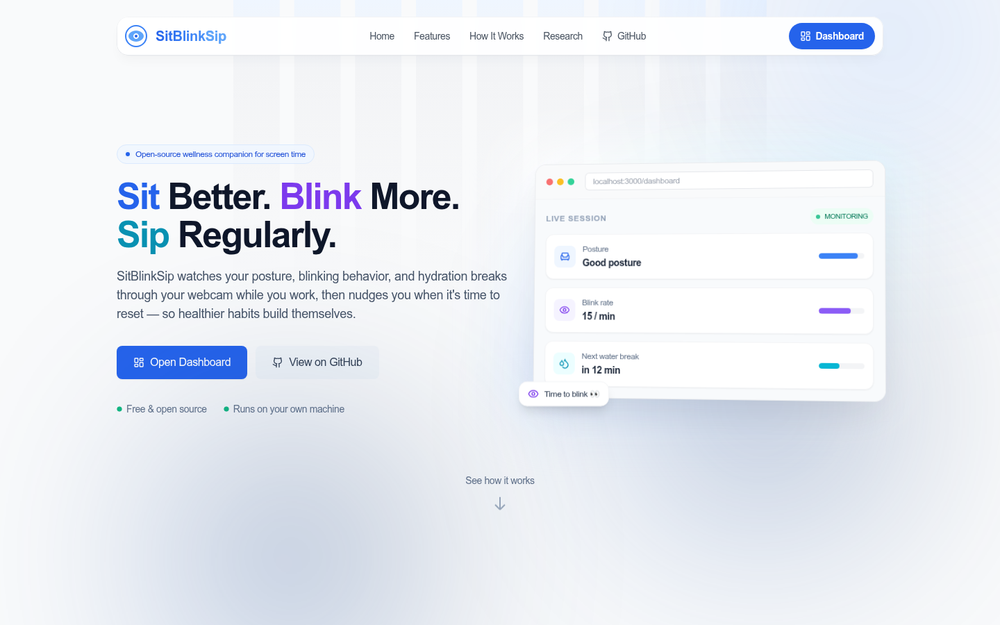
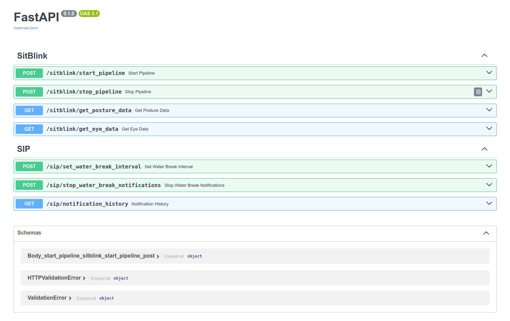

# SitBlinkSip

SitBlinkSip is a health-focused application designed to help developers and individuals who spend extended hours in
front of a computer. This app monitors your body posture, tracks eye blinking patterns, and reminds you to take water
breaks, promoting overall well-being during long work sessions.

## Problem Statement

Many developers and tech workers often forget to take care of their health while immersed in work. Common issues
include:

- **Poor posture** leading to back and neck pain.
- **Eye strain** and dryness due to a lack of blinking.
- **Dehydration** from forgetting to take water breaks.

The goal of SitBlinkSip is to tackle these issues by providing timely reminders and real-time monitoring to ensure a
healthy work routine.

## Features

- **Real-time Posture Monitoring**: Detects improper posture (slouching or leaning) and alerts users to sit correctly.
- **Eye Blink Detection**: Monitors eye blinking, sending a notification if no blink is detected for over 60 seconds to
  prevent dry eyes.
- **Water Break Reminders**: Sends periodic notifications to ensure users stay hydrated.

## Objectives

- **Promote Healthy Posture**: Reduce the risk of back and neck pain by encouraging proper posture.
- **Prevent Eye Strain**: Avoid eye dryness and strain through timely blink reminders.
- **Encourage Hydration**: Prevent dehydration and fatigue by reminding users to take water breaks.

## Future Enhancements

- **Detailed Analytics**: Track user health data over time to provide actionable insights.
- **Wearable Device Integration**: Support for smartwatches and other wearables for more comprehensive monitoring.

## Getting Started

### Prerequisites

- [Docker](https://docs.docker.com/get-docker/) and Docker Compose v2 (for the recommended path), **or** Python 3.10+ and Node 20+ (for a manual setup).
- [Git LFS](https://git-lfs.com/) — the eye-detection model
  (`resources/dlib_models/shape_predictor_68_face_landmarks.dat`) is stored via
  Git LFS. Run `git lfs install` once before cloning, otherwise you'll only get a
  pointer file and detection will fail at runtime.
- A webcam. SitBlinkSip captures video **in your browser** via `getUserMedia` and
  streams frames to the backend over a WebSocket — the backend never touches your
  camera device directly, so no special Docker device passthrough is required.

### Run with Docker (recommended)

The easiest way to run both the backend (FastAPI) and frontend (Next.js) without
setting up Python, Node, or the database by hand:

1. Clone the repository.

    ```bash
    git clone https://github.com/ishworrsubedii/SitBlinkSip.git
    cd SitBlinkSip
    ```

2. Build and start both services.

    ```bash
    docker compose up --build
    ```

   The first build compiles `dlib` from source, which can take several minutes —
   subsequent builds are cached and much faster.

3. Open the app.

    - Frontend: [http://localhost:3000](http://localhost:3000)
    - Backend API: [http://localhost:8000](http://localhost:8000)

   The SQLite database lives in `./data` on your machine (mounted into the
   backend container), so it persists across `docker compose down`/`up` cycles.

4. When you're done, stop the containers with `docker compose down` (add `-v` only
   if you also want to drop anything Docker-managed — the database itself lives in
   `./data` on the host either way, so it survives `down` regardless).

#### Useful Docker commands

| Task | Command |
| --- | --- |
| Run in the background | `docker compose up --build -d` |
| Tail logs | `docker compose logs -f` (or `-f backend` / `-f frontend`) |
| Rebuild after pulling changes | `docker compose up --build` |
| Restart a single service | `docker compose restart backend` |
| Stop everything | `docker compose down` |
| Reset the database | stop the app, then delete the `./data` folder |

#### Pointing the frontend at a different backend host

The frontend bakes `NEXT_PUBLIC_API_BASE_URL` / `NEXT_PUBLIC_WS_PREFIX` /
`NEXT_PUBLIC_HTTP_PREFIX` into the client bundle at **build** time (see
`frontend/Dockerfile`), because the browser — not the container — is what talks to
the backend. If you're running the backend somewhere other than
`localhost:8000` (e.g. a remote server or a different port), update the `args:`
under the `frontend` service in `docker-compose.yml` and rebuild:

```yaml
frontend:
  build:
    args:
      NEXT_PUBLIC_API_BASE_URL: your-host:8000
```

#### Troubleshooting

- **"Port already allocated"** — something else is already using 3000 or 8000.
  Stop it, or change the left-hand side of the `ports:` mapping in
  `docker-compose.yml` (e.g. `"3001:3000"`).
- **Detection isn't running / model errors** — double-check Git LFS actually
  pulled the real model file and not a pointer (see Prerequisites above).
- **Camera permission blocked** — browsers only allow `getUserMedia` on
  `localhost` or HTTPS. Accessing the frontend via `http://localhost:3000` (not a
  raw IP) satisfies this.

### Manual setup (without Docker)

1. Clone the repository (see the Git LFS note in Prerequisites above).

    ```bash
    git clone https://github.com/ishworrsubedii/SitBlinkSip.git
    cd SitBlinkSip
    ```

2. Install the required dependencies.

    ```bash
    pip install -r requirements.txt
    ```

3. Run the backend.

    ```bash
    python main.py
    ```

4. Open the API in your browser at [http://localhost:8000](http://localhost:8000).

5. In a separate terminal, run the frontend:

    ```bash
    cd frontend
    npm install
    npm run dev
    ```

    Then open [http://localhost:3000](http://localhost:3000).

## How to Use SitBlinkSip

Once the frontend is running at [http://localhost:3000](http://localhost:3000):

1. **Open the dashboard.** Click **Dashboard** on the landing page (or go straight
   to `/dashboard`). On first visit you'll be asked for a name — this creates a
   lightweight profile so your data and reminder settings are saved between
   sessions.
2. **Start a monitoring session.** Go to **Services** in the sidebar, allow camera
   access when your browser prompts you, and toggle on the checks you want:
   **Posture** and/or **Eye Blink**. Video frames are captured in your browser and
   streamed to the backend over a WebSocket for real-time analysis — nothing is
   recorded or stored.
3. **Get reminded.** While a session is active, SitBlinkSip nudges you (an
   in-app toast plus an optional sound) when it detects slouching or leaning, a
   stretch of time with too few blinks, or when a water break is due.
4. **Tune it to you.** Head to **Settings** to change the water-break interval,
   adjust posture/blink detection thresholds, or turn alert sounds on or off.
5. **Review your history.** **Overview** and **Analytics** chart your posture and
   blink data over time (last hour up to last 24 hours), and **Activity** shows a
   log of recent events — useful for spotting patterns across work sessions.

## Frontend UI



## Fastapi UI



## Author Information

- **Email**: [ishworr.subedi@gmail.com](mailto:ishworr.subedi@gmail.com)
- **GitHub**: [ishworrsubedii](https://github.com/ishworrsubedii)
- **LinkedIn**: [linkedin.com/in/ishworrsubedii](https://www.linkedin.com/in/ishworrsubedii/)
- **Twitter**: [@ishworr_](https://x.com/ishworr_)
- **Portfolio**: [ishwor-subedi.com.np](https://ishwor-subedi.com.np/)

For detailed setup instructions, visit our [Open Source Guidelines](./CONTRIBUTING.md).


---

